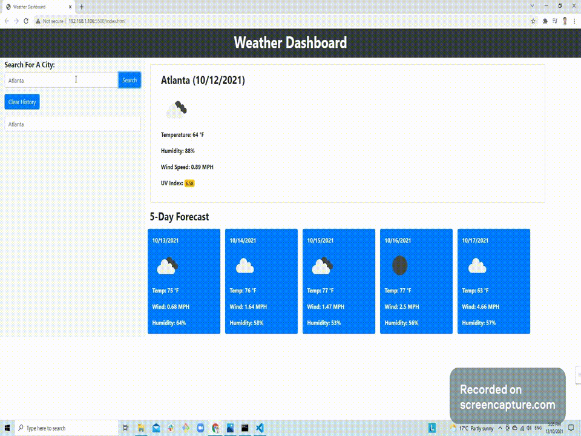

<h1 align="center"> WEATHER DASHBOARD 🚩</h1>
<br>
<p align="center">
  <a href="#">
  
  <a href="#">
  
  <a href="#">
  
  <a href="#">
  
  <a href="#">
  
  <a href="#">
  
  <br>
  <a href="https://www.buymeacoffee.com/adampham123">
  
  <a href="#">
  
  <a href="#">
  
  <a href="https://github.com/ThiHoangPham/weather-dashboard/blob/main/LICENSE">
  
  </a>
  <a href="#">
  
  <a href="#">
  
  </a>
  <a href="#">
  
  </a>
  <a href="#">
  
  </a>
  <a href="#">
  
  </a>
</p>
<hr>

  <h3 align="center">
    <p align="center">
      <a href="https://github.com/ThiHoangPham/weather-dashboard"><strong>Explore the docs »</strong></a>
      <br />
      <br />
      <a href="https://thihoangpham.github.io/weather-dashboard/">Demo</a>
      ·
      <a href="https://github.com/ThiHoangPham/weather-dashboard/issues">Report Bug</a>
      ·
      <a href="https://github.com/ThiHoangPham/weather-dashboard/issues">Request Feature</a>
    </p>
  </table>

  <details>
    <summary>Table of Contents</summary>
    <ul>
      <li><a href="#about-the-project">About The Project</a>
      <li><a href="#user-story">User Story</a></li>
      <li><a href="#acceptance-criteria">Acceptance Criteria</a></li>
      <li><a href="#live-demo-github">Live Demo</a></li>
      <li><a href="#contributor">Contributor</a></li>
      <li><a href="#contribution">Contribution</a></li>
      <li><a href="#license">License</a></li>
      <li><a href="#more-about-me">More About Me</a></li>
    </ul>
  </details>

  <br />

# About The Project
  Building a weather dashboard that will run in the browser and feature dynamically updated HTML and CSS, and using the OpenWeather One Call API to retrieve weather data for cities. Read through the documentation for setup and usage instructions, and localStorage to store any persistent data.

  

# User Story
```
AS A traveler
I WANT to see the weather outlook for multiple cities
SO THAT I can plan a trip accordingly
```

# Acceptance Criteria
```
GIVEN a weather dashboard with form inputs
WHEN I search for a city
THEN I am presented with current and future conditions for that city and that city is added to the search history
WHEN I view current weather conditions for that city
THEN I am presented with the city name, the date, an icon representation of weather conditions, the temperature, the humidity, the wind speed, and the UV index
WHEN I view the UV index
THEN I am presented with a color that indicates whether the conditions are favorable, moderate, or severe
WHEN I view future weather conditions for that city
THEN I am presented with a 5-day forecast that displays the date, an icon representation of weather conditions, the temperature, the wind speed, and the humidity
WHEN I click on a city in the search history
THEN I am again presented with current and future conditions for that city
```

# Live Demo Github: 
<a href="https://thihoangpham.github.io/weather-dashboard/">
  
  </a>

# Contributor
<a href="https://github.com/ThiHoangPham/weather-dashboard">
  
  </a>

# Contribution
This how you can contribute to this project:
```
> Clone the project to your local 
> Create your own branch
> Add contribution codes/commit/push to remote repo
> Create a pull request
```
# License
  Distributed under the [MIT License](https://github.com/ThiHoangPham/weather-dashboard/blob/main/LICENSE)

# More About Me
  <a href="https://github.com/ThiHoangPham">
  
  <a href="https://thihoangpham.github.io/react-portfolio/">
  
  <a href="https://www.linkedin.com/in/thaihoangpham/">
  
  <a href="mailto:thaihoangpham2008@gmail.com">
  
  </br>
  <p align ="right"><a href="#">↥ back to top</a></p>

- - -

© 2021 Hoang Thai Pham(Adam): Server-Side APIs - Weather Dashboard
